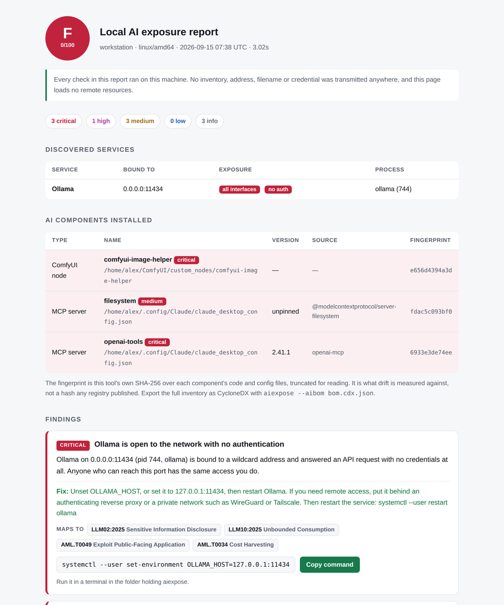
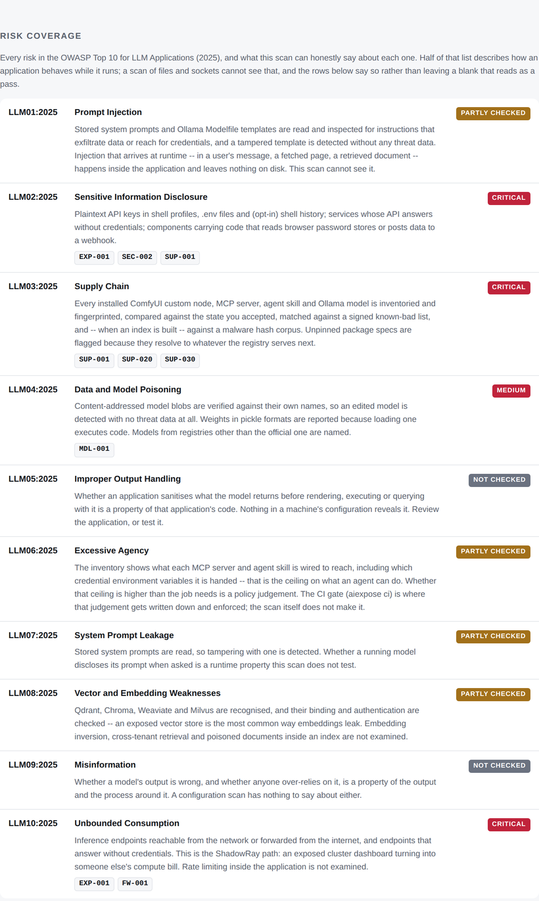
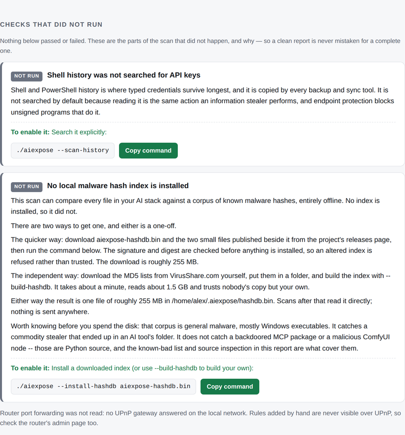

# aiexpose

**Is your local AI reachable by anyone but you?** And has anything in it changed
behind your back?

One command tells you which AI services are running on this machine, which of
them are open to your network or the internet, whether their APIs answer with no
credentials at all, whether your API keys are sitting in plaintext, and whether
any installed component is on a published list of malicious ones.

It reads. **It never changes your machine.** Every finding names the exact
command that fixes it, and you run it.

<p align="center">
  
</p>

<p align="center"><em>A real scan of a deliberately misconfigured test machine.</em></p>

---

## Install

**With Go 1.22+** — this is the smoother path today, and a locally compiled
binary is rarely quarantined by antivirus:

```bash
git clone https://github.com/MC-kakadu/AIexpose.git && cd AIexpose
go build ./cmd/aiexpose
./aiexpose --install-rules internal/feed/data/feed.json
./aiexpose
```

**Without Go** — download the binary for your platform from
[Releases](https://github.com/MC-kakadu/AIexpose/releases), plus
`aiexpose-rules.json` and its `.sig`, and keep all three in one folder. Windows
users can double-click the `.exe`.

A scan takes a few seconds and opens an HTML report in your browser.

> Downloads are not code-signed yet, so Windows shows a SmartScreen prompt and
> macOS Gatekeeper blocks them outright. [ANTIVIRUS.md](ANTIVIRUS.md) explains
> why a security scanner trips scanners, and what to do.

---

## Why

Researchers found [**175,000 publicly exposed Ollama servers** across 130
countries](https://thehackernews.com/2026/01/researchers-find-175000-publicly.html),
a large share of them answering without any authentication. Attackers have been
observed hijacking misconfigured local model servers and using them as the
reasoning engine for their own tooling, and stolen inference credentials have run
up five-figure daily bills on victim accounts.

Meanwhile the things you install into that stack execute code. A ComfyUI node
called [`ComfyUI_LLMVISION`](https://www.vpnmentor.com/news/comfyui-malicious-custom-node/)
shipped trojanized `openai` and `anthropic` wheels that harvested browser
passwords, crypto wallets and screenshots. An npm package called
[`postmark-mcp`](https://www.koi.security/blog/postmark-mcp-npm-malicious-backdoor-email-theft)
behaved normally for months, then started silently copying every email its agent
sent to its author.

Nothing about either was visible from the outside. Both were visible on disk.

---

## What it checks

43 distinct findings across seven areas:

| | |
|---|---|
| **Exposure** | Which AI services are listening, on which interface, and whether the API answers without credentials. 22 services recognised — Ollama, LM Studio, ComfyUI, Open WebUI, vLLM, LocalAI, Jupyter, Qdrant, Chroma, Weaviate, Milvus, AnythingLLM, Flowise, Dify, n8n, SillyTavern and more |
| **Router** | Whether your gateway forwards an internet port to one of them, read over UPnP on your LAN only |
| **Host firewall** | ufw / firewalld / nftables / iptables, macOS application firewall, Windows Defender Firewall |
| **Credentials** | Plaintext API keys in shell profiles, `.env` files, AI tool folders and text notes — always reported masked |
| **Supply chain** | Every ComfyUI custom node, MCP server and Ollama model inventoried, fingerprinted, compared against the state you accepted, and matched against a signed known-bad list |
| **Model integrity** | Content-addressed model blobs verified against their own digests; pickle-format weights that execute code on load; models from unofficial registries |
| **Malware hashes** | Every hashed file against a local offline corpus of 42 million malware hashes — optional, and never downloaded for you |

---

## The part that makes it different

Most scanners tell you what they found. The interesting question is what they
**didn't look at**, because that is what a clean result is hiding.

Every report carries a coverage map of the OWASP Top 10 for LLM Applications and
states, per risk, what this scan can and cannot see:

<p align="center">
  
</p>

And a section for the checks that did not happen, with the reason and the
command that enables each one:

<p align="center">
  
</p>

Half of the OWASP LLM Top 10 describes how an application behaves while it runs.
A scan of files and sockets cannot see that. The report says so rather than
leaving a blank that reads as a pass.

---

## Privacy

- **Scans never use the network.** Not for telemetry, not for lookups. The only
  command that does is `--update-feed`, which you run deliberately: a plain GET
  for two static files that sends nothing about this machine.
- **Read-only.** Earlier versions rewrote launch scripts and deleted router port
  mappings. That code is gone, and a test fails the build if it comes back.
- **No child processes during a scan** except the browser it opens at the end,
  and `--safe-mode` turns even that off.
- **Credentials are masked** everywhere, including the JSON output.
- **Your documents are not read unless you ask.** Desktop, Documents and
  Downloads need `--scan-docs`; shell history needs `--scan-history`. Both are
  opt-in because reading them unasked is what an information stealer does. The
  report states which were skipped.
- **The malware hash index comes from files you download yourself.** The tool
  verifies and installs; it never fetches.

---

## Usage

```
aiexpose                          scan and open the report
aiexpose --scan-docs              also search Desktop, Documents and Downloads for keys
aiexpose --accept                 record the current components as reviewed
aiexpose --fail-on high           exit 1 if anything high or critical is found
aiexpose --json                   machine-readable output
aiexpose --aibom bom.cdx.json     CycloneDX 1.6 AI bill of materials
aiexpose --safe-mode              skip everything endpoint protection tends to block
aiexpose ci --sarif out.sarif     gate a repository in CI
```

Findings map to [OWASP LLM Top 10 (2025)](https://genai.owasp.org/llm-top-10/),
[MITRE ATLAS](https://atlas.mitre.org/) and [MITRE ATT&CK](https://attack.mitre.org/),
so one line of a report means something to an auditor outside this tool.

Full flag reference: `aiexpose --help`. Longer guides:
[ANTIVIRUS.md](ANTIVIRUS.md) (why a security scanner trips scanners),
[RELEASING.md](RELEASING.md), [SECURITY.md](SECURITY.md).

---

## Malware hashes, offline

Three ways to get the index, each a one-off:

```bash
# 1. install the published one (signature and digest verified before anything is written)
aiexpose --install-hashdb aiexpose-hashdb.bin

# 2. build it yourself from VirusShare MD5 lists, trusting nobody's copy
aiexpose --build-hashdb ./virusHashDb

# 3. copy ~/.aiexpose/hashdb.bin and hashdb.meta.json from another machine of your own
```

**Be clear about what this catches.** That corpus is general malware, mostly
Windows executables. It recognises a commodity stealer that ended up in an AI
tool's folder. It does **not** recognise a backdoored MCP package or a malicious
ComfyUI node — those are source code no malware corpus indexes. The known-bad
list and the source inspection cover that case, and the three layers barely
overlap, which is the reason to run all of them.

It is a 255 MB release asset rather than a repository file because GitHub
refuses anything over 100 MiB, and the corpus cannot honestly be made smaller:
42 million random 64-bit prefixes need about 40 bits each however they are
encoded, and a shorter prefix would give a scan a percent-level chance of
calling a clean file malware.

---

## Known limits

**The known-bad list is short.** Fourteen entries, each citing a primary source.
The format took a weekend; keeping it current is the actual work, and it is the
part that would benefit most from other people contributing.

It is also narrower than the published record, on purpose. Documented
compromises of `ultralytics`, `litellm`, Hugging Face model repositories and
editor extensions are **not** on it, because this scanner does not inventory
Python libraries, model repositories or editor extensions. An entry for
something the scanner never looks at would be a rule that can never fire, and a
list padded with those reads as coverage while providing none.

**The detection patterns are barely tested.** Every shipped pattern is asserted
to compile and the loaded rule count is asserted to equal the shipped count, so
a typo'd regex cannot be silently skipped while the report still claims eleven
rules. That is the floor, not validation. Beyond compiling, exactly one of the
eleven has a true-positive and a negative case: `EXFIL-DISCORD`. Treat an
indicator finding as a prompt to go and look, not as a verdict.

**Real-machine testing is thin.** Windows, Linux and macOS builds all run, but
the number of distinct machines this has been exercised on is small.

**A false positive is a bug.** This tool tells people their machine may be
compromised, and being wrong about that has a cost. Please report one — with the
finding ID and what it fired on, and **never an unmasked credential**.

---

## Building

```
Go 1.22+, built with 1.24.7 · zero third-party dependencies · no go.sum
212 tests · reproducible builds · CI on Linux, macOS and Windows
```

The dependency count is not a slogan: there is no `require` block and no
`go.sum`. Everything is the standard library, so the code you audit is the code
that runs.

```bash
go test ./...
./build.sh --check-reproducible   # builds twice, must be byte-identical
```

Reproducibility is a release blocker, not a nicety — it is what lets someone
whose antivirus quarantined a download rebuild and confirm the hash themselves.

---

## Contributing

The most valuable contribution is an entry for the known-bad list with a primary
source, or a false positive you hit. See [SECURITY.md](SECURITY.md) for how to
report something sensitive.

## License

Apache 2.0.
